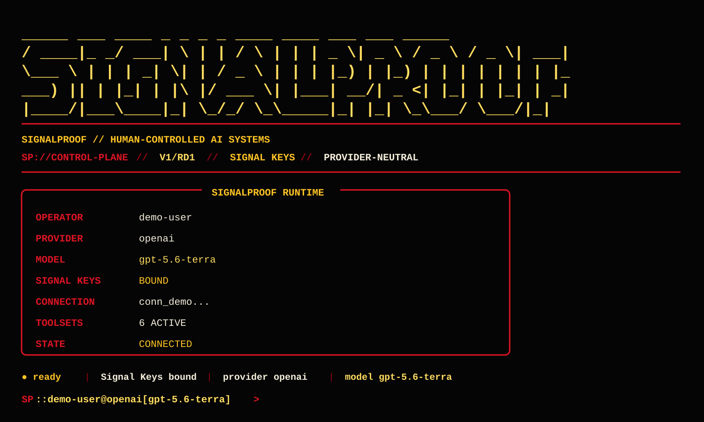

# Signalproof Public

This repository is a public distribution surface for materials that Signalproof intentionally releases for public use.

## Signalproof CLI preview

This public preview uses sanitized demo identity data. It shows the intended red-and-gold Signalproof CLI terminal identity, Signal Keys status, provider-neutral runtime presentation, and connected command prompt without exposing private connection details.

## License

Unless a file or directory states otherwise, original Signalproof source code and documentation in this repository are licensed under the **Apache License 2.0**. See [`LICENSE`](LICENSE).

Apache 2.0 permits use, modification, reproduction, and distribution, including commercial use, subject to the terms of the license. Required copyright, license, attribution, and NOTICE obligations must be preserved where applicable.

**Public or free does not mean public domain.** The Apache License 2.0 is the permission grant governing Signalproof-owned material released here.

## Third-party material

Third-party software, models, documentation, assets, services, trademarks, or other components do **not** become Apache-2.0 Signalproof property merely because they are referenced, downloaded, bundled, or used by material in this repository.

Each third-party component retains its own upstream license, copyright, attribution, model license, or service terms. Any bundled third-party material must preserve those obligations and be recorded in `THIRD-PARTY-NOTICES.md` when applicable.

## Signalproof name and marks

The Apache License 2.0 does not grant permission to use Signalproof trade names, trademarks, service marks, logos, or product branding except as required for reasonable attribution and description under the license.

## Governance rule

Before adding a public dependency or redistributing an upstream component:

`IDENTITY -> SOURCE -> VERSION -> LICENSE/TERMS -> ATTRIBUTION/NOTICE -> SECURITY -> PUBLIC RELEASE`

If the license or redistribution terms are unresolved, the component should not be packaged into a public Signalproof release.

Copyright 2026 Doc Reo / Signalproof.
